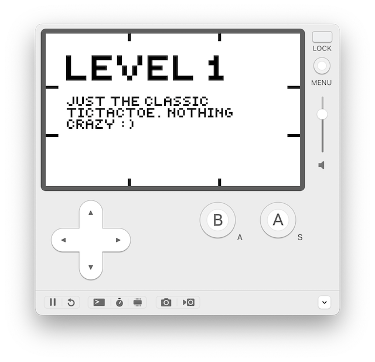
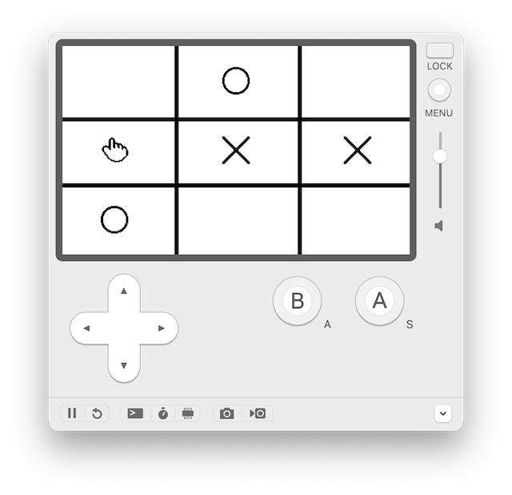

# 😈 TicTacToe: A Playdate game built in Rust

<a href='https://www.recurse.com/scout/click?t=c7bc9ba4cb3e6725e05e413f16f8c5a3' title='Made with love at the Recurse Center'></a>

This is a version of the classic TicTacToe game that runs on the [Playdate](https://play.date) handheld gaming console. All of the code is written in Rust courtesy of the unofficial [crankstart](https://crates.io/crates/crankstart) library. It has only been tested on the Playdate simulator.

 

## Game Levels

This version of TicTacToe has 7 increasingly chaotic levels as follows. Levels marked ✅ have been implemented, ❌ have not yet been implemented:

| level | level name                             | rules                                                                                                                                               |
|-------|----------------------------------------|-----------------------------------------------------------------------------------------------------------------------------------------------------|
| 1 ✅   | **basic tictactoe**                    | computer selects a move randomly, although it almost never picks an optimal or sensible move                                                        |
| 2 ✅   | **reverse tictactoe**                  | reverse of basic game play, where player loses if they get any 3 in a row                                                                           |
| 3 ✅   | **forgiving disappearing tictactoe**   | same rules as basic game play, except each player's entry disappears from the screen on the next turn; the selected slot is remembered by the game  |
| 4 ✅   | **unforgiving disappearing tictactoe** | same as level 3, except if you try to play in a cell already filled you lose                                                                        |
| 5 ✅   | **reverse disappearing tictactoe**     | levels 2 and 3 combined                                                                                                                             |
| 6 ✅   | **rearranging tictactoe**              | same rules as basic game play, except every turn, the x's and o's are shuffled                                                                      |
| 7 ✅   | **murder tictactoe**                   | same rules as basic game play, except the human player can choose to override the computer's entry instead of playing their turn                    |
| 8 ❌   | **extra hard tictactoe**               | the computer employs the unbeatable [minimax algorithm](https://www.baeldung.com/java-minimax-algorithm) and will almost always win or tie the game |

**Note**: at the end of each game, the player can choose to repeat the same level or advance to the next level
regardless of game status (win, lose or tie). Currently, scores are not tallied.

## Running the game

This game has been tested with:
- Rust 1.88.0-nightly (as of 2025-04-17)
- Playdate SDK 2.6.2
- Locally modified versions of `crankstart` and `crankstart-sys`

### Pre-requisites

You'll need to be set up for Playdate game development with Rust:
1. Install Rust, of course. I recommend using `rustup`: https://www.rust-lang.org/tools/install.
2. Install the Playdate SDK at https://play.date/dev. The SDK comes with the Playdate simulator.
3. Install the `crank` command line tool by following the instructions on https://github.com/pd-rs/crank.
4. Clone or download this project to your computer, then update the location of the `crankstart` and `crankstart-sys` dependencies in [Cargo.toml](Cargo.toml) to either point to the released dependencies on [crates.io](https://crates.io) or your local copy if you're using that. 

### To build and run the game on the Playdate simulator
Run the following command from the project root directory:

```bash
crank run --release
```

### To build and run the game on the Playdate device
You obviously need a Playdate first. 

If you have one already, run the following command from the project root directory:

```bash
crank build --device --release
```
Compress the build file produced at `target/TicTacToe.pdx`. Then sideload it onto your Playdate at https://play.date/account/sideload

### If you want to skip all that and just run the last version of the game on your Playdate
Download the game file from the project [releases](../../releases/) (do not unzip it). Then sideload it onto your Playdate at https://play.date/account/sideload
